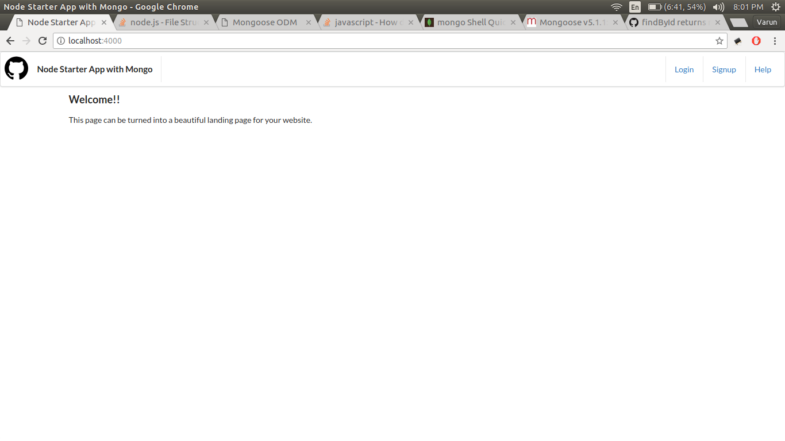
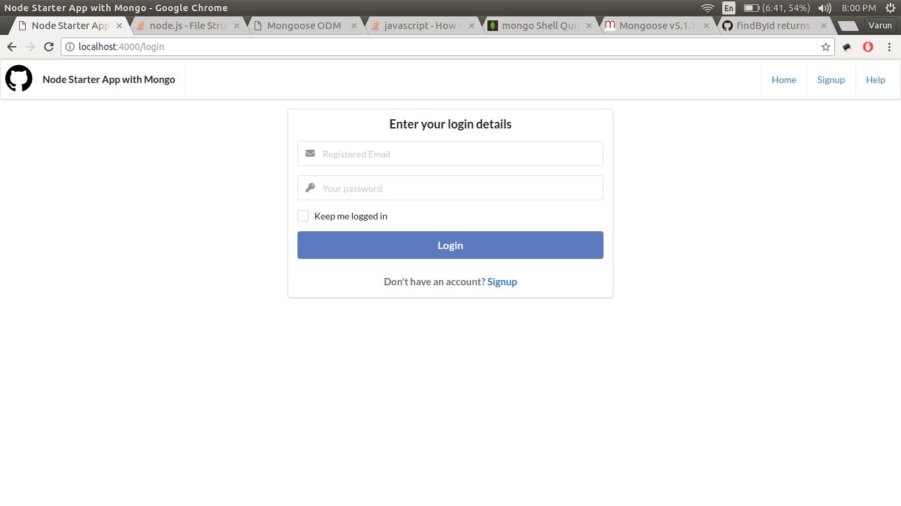
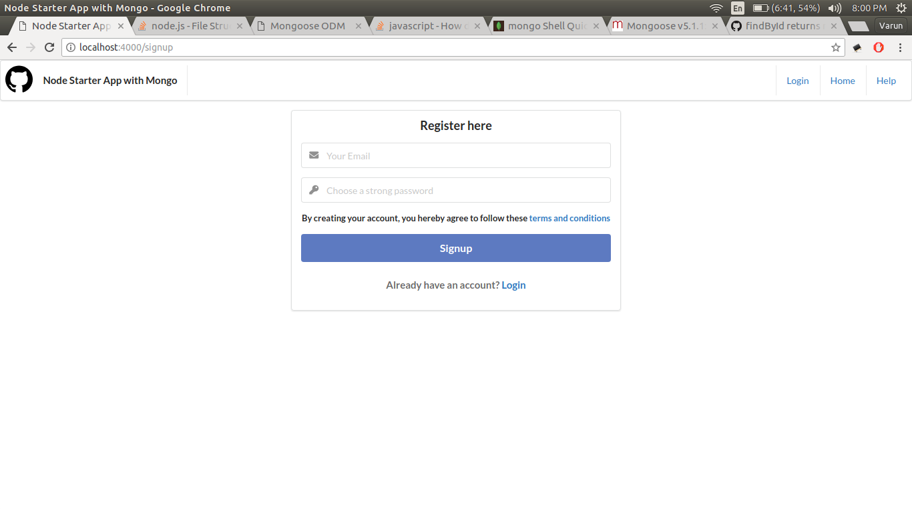

## node-starter-app-mysql

A boilerplate for Node.js web applications.

It is based on following libraries and frameworks-

1. Express.js
2. Ejs template engine
3. mongoose
4. jQuery
5. Semantic UI
6. JsonWebToken for authentication

### Folder Structure

1. **bin**: It contains the main file 'www' which starts node server
2. **config**: All the configurable parameters and credentials
3. **data**: json data
4. **logs**: logs dumps here
5. **middlewares**: All the middlewares defined here
6. **models**: Sequelize models (database schema)
7. **modules**: Independent modules used throughout the app are defined here
8. **public**: All the static resources (js, css, images)
9. **routes**: All the routes
10. **services**: These act as middlemen between routes and database. All the database operations is made here.
11. **views**: Contains HTML and .ejs files used for rendering to frontend

### How to install

1. `git clone https://github.com/varunon9/node-starter-app-mongo.git`
2. `cd node-starter-app-mongo`
3. `npm install`
4. `cd public`
5. `bower install`
6. create database 'nodeStarterAppMongo' in MySql `create database nodeStarterAppMongo`
7. come back to project directory `cd ..`
8. start app `nodemon bin/www` or `node bin/www`
9. visit localhost:4000 in browser

### Naming Conventions

1. using camelCase for naming variables, functions in javascript
2. using camelCase for naming MySql tables, CSS IDs
3. using hyp-hens for naming CSS classes
4. using under_scores for naming files and folders 
5. using UPPERCASE for constants and global variables
6. using PascalCase for naming Javascript classes 

### Coding Conventions

1. Line length max 80 characters for Javascript
2. Line length max 120 characters for HTML
3. Standard JS coding conventions- https://www.w3schools.com/js/js_conventions.asp

### Screenshots
|  |  |
| --- | --- |
| | |
| | |

#### For query/issues create Github issue or contact: varunon9@gmail.com